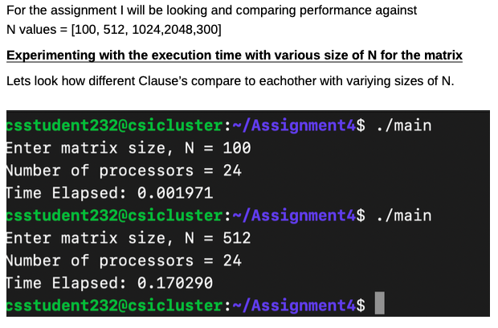

# Unix_Development

## Overview

This repository features a collection of C programs demonstrating fundamental and advanced concepts in Unix programming, networking, and concurrent programming with threads. Each program showcases different aspects of system-level programming in a Unix environment.

#### Key Highlights


- **Banerjes Tests**:
The Banerjee test is an important concept in compiler optimization and is used to improve the performance of code by identifying opportunities for parallelization and optimization in loops.


- **BLAS**: Uncover efficient and optimized Basic Linear Algebra Subprograms (BLAS) implementations to accelerate mathematical computations.

- **OPENMP**: Dive into the power of Open Multi-Processing (OpenMP), exploring parallelism and concurrent execution for enhanced performance.

- **ATLAS**: Discover the capabilities of the Automatically Tuned Linear Algebra Software (ATLAS) for optimized numerical operations.


## command-line-utility
Description: The program is designed to read and print out the first or last 'n' lines from a file. It can also print out either the even or odd lines contained within the file.

- Functions:
    - print_manual(): Displays the manual for the program, which includes the developer's name, a brief description, usage instructions, and additional notes. It mentions that the default number of lines to read is 10, and provides options for reading the header or tail of a file, as well as an option for the version (-v).
    - head_of_file(int n): Likely intended to print the first 'n' lines of a file (header).
    - tail_of_file(int n): Likely intended to print the last 'n' lines of a file (tail).
    - lineCount(char *str): This function probably counts the number of lines in a given string or file.
    - odd_even(int p): This function is likely designed to print out either odd or even lines from a file.

- Constants:
    - MAX_LINE_LENGTH: Defined as 1000, which might be the maximum length of a line that this program can handle.
    - MAX_NUM_LINES: Defined as 1000, which could be the maximum number of lines the program can process.


### Usage: 
The program accepts command-line arguments to specify the number of lines to read (-n), to print the header (-h) or tail (-t) of a file, and an option to display the version (-v).
Notes: The developer notes that they did not implement dynamic memory allocation using malloc, and instead opted for a fixed array size. They also mention the absence of functionality for reading from standard input.


## matrix_with_threads

### Contents

- `StandardNetwork.c`: A program demonstrating standard networking operations in C. This file is likely to contain code for basic network communication tasks.

- `matrix_with_threads.c`: This program implements matrix operations using threads, showcasing concurrent programming techniques and their application in computational tasks.

- `client_worker.c`: A client-side networking program, typically used in client-server architectures. It likely contains implementations for connecting to and interacting with a server.

- `master_server.c`: The server-side counterpart to `client_worker.c`, handling incoming connections and requests from clients.

- `assign1-19200704.c`: A utility program for file processing, capable of reading and manipulating text files with various options like displaying the header, tail, or specific lines of the file.

## Multi-Threading
- `main_thread.c`: A program focusing on main thread operations, possibly demonstrating the creation and management of a primary thread in a multi-threading environment.

- `single_worker.c`: Likely deals with single-threaded operations or computations, potentially used as a contrast to multi-threaded approaches.

- `squareroot.c`: A program specifically designed to calculate square roots, potentially showcasing mathematical computations or algorithm implementations in C.

- `multi_thread.c`: Focuses on multi-threading concepts, possibly demonstrating how to handle multiple threads simultaneously for concurrent tasks.

## Networking
- Client and Server connection via Sockets

## Parallel Matrix Computation
- Utilised threading to break matrix computations into different parts.
- **Parallel *processes***
    - each running on a separate processor
    - using message passing to communicate with the others

## Pthreads
- Parallel threading using the Pthread library

## Exec and Forking
- Forking using exec and execv

## Performance Optimisations
- Blas routine dgemm implementation
- Multiplication of matrix blocks in the implementation of the blocked ijk
algorithm
- parallel Pthreads program computing the norm of the product of two n×n dense
matrices on a p-processor SMP so that
p threads are involved in the parallel computations.
- Message Passing Interface (MPI)

**Write a parallel `MPI` program computing the product of two n×n dense matrices on p processors.**

```
Write a parallel MPI program computing the product of two n×n dense matrices on p processors so that
• p processors are involved in the computations.
• The 2-dimensional parallel algorithm of matrix multiplication is employed:
- the matrices are identically and equally partitioned in two dimension into p squares
- there is one-to-one mapping between the partitions and the processors
- each processor is responsible for computation of the corresponding square of the resulting
matrix
```
Comparision between MPI and Serial Matrix Multiplication

Compile

```python
    mpicc mpi.c -o mpi
```

Run 
```
    ./mpi 2048
or  mpirun -np 2 --hostfile hostfile mpi 2048
```
- arg1 = Matrix Size N




### OpenMP Programming Model:

* OpenMP is based upon the existence of multiple threads in the shared memory programming paradigm. A shared memory process consists of multiple threads.

* OpenMP is an explicit (not automatic) programming model, offering the programmer full control over parallelization.

* OpenMP uses the fork-join model of parallel executio


## Experimented with the program and build:
1) The dependence of the execution time of the program on the matrix size n.
2) The speedup over a serial counterpart of the program. 
3) The dependence of the execution time of the program on chunk size in the schedules - static, dynamic and guided. 

Comparing different types for schedules
- Defualt
- Static
- Dynamic
- Guided

### Running the program

    compile: gcc -fopenmp -o main main.c
    Run: ./main
    
### Code snippet
    #pragma omp for schedule(dynamic, delta)
    for (j = dat->start; j < dat->end; j++)
    {
        for (i = 0; i < A.row_size; i++)
        {
            acc = 0;
            for (k = 0; k < B.col_size; k++)
                acc += A.data[i * A.col_size + k] * B.data[k * B.col_size + j];

            // #pragma omp critical
            C.data[i * C.col_size + j] = acc;
        }
    }

